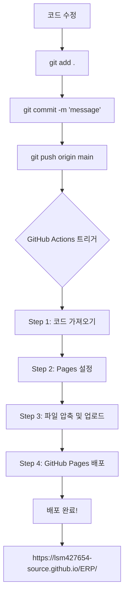

# GitHub Pages 자동 배포 가이드

> 이 문서는 `.github/workflows/deploy.yml` 파일이 어떻게 작동하는지 대학생도 이해할 수 있도록 설명합니다.

---

## 📌 목차

1. [GitHub Actions란?](#github-actions란)
2. [GitHub Pages란?](#github-pages란)
3. [deploy.yml 파일 전체 구조](#deployyml-파일-전체-구조)
4. [코드 한 줄씩 설명](#코드-한-줄씩-설명)
5. [실제 작동 과정](#실제-작동-과정)
6. [자주 묻는 질문](#자주-묻는-질문)

---

## GitHub Actions란?

**GitHub Actions**는 GitHub에서 제공하는 **자동화 도구**입니다.

### 일상 비유
- **사람이 직접**: 코드를 수정 → 파일 업로드 → 서버에 배포 → 웹사이트 확인
- **GitHub Actions**: 코드를 수정 → GitHub에 push → **자동으로 배포됨** ✨

### 핵심 개념
- **Workflow (워크플로우)**: 자동으로 실행할 작업의 흐름
- **Trigger (트리거)**: 워크플로우를 실행시키는 조건 (예: 코드 push)
- **Job (작업)**: 워크플로우 안에서 실행되는 단위 작업
- **Step (단계)**: 작업 안에서 실행되는 개별 명령

---

## GitHub Pages란?

**GitHub Pages**는 GitHub에서 제공하는 **무료 웹 호스팅 서비스**입니다.

### 특징
- ✅ **무료**: 비용 없이 웹사이트 호스팅
- ✅ **간편**: GitHub 저장소만 있으면 됨
- ✅ **자동 HTTPS**: 보안 연결 자동 제공
- ✅ **빠름**: GitHub의 CDN을 통해 빠른 속도

### URL 형식
```
https://<사용자명>.github.io/<저장소명>/
```

우리 프로젝트의 경우:
```
https://lsm427654-source.github.io/ERP/
```

---

## deploy.yml 파일 전체 구조

```yaml
name: Deploy to GitHub Pages

on:
  push:
    branches: ["main"]
  workflow_dispatch:

permissions:
  contents: read
  pages: write
  id-token: write

concurrency:
  group: "pages"
  cancel-in-progress: false

jobs:
  deploy:
    environment:
      name: github-pages
      url: ${{ steps.deployment.outputs.page_url }}
    runs-on: ubuntu-latest
    steps:
      - name: Checkout
        uses: actions/checkout@v4
      
      - name: Setup Pages
        uses: actions/configure-pages@v4
      
      - name: Upload artifact
        uses: actions/upload-pages-artifact@v3
        with:
          path: '.'
      
      - name: Deploy to GitHub Pages
        id: deployment
        uses: actions/deploy-pages@v4
```

---

## 코드 한 줄씩 설명

### 1. 워크플로우 이름 설정

```yaml
name: Deploy to GitHub Pages
```

**의미**: 이 워크플로우의 이름을 "Deploy to GitHub Pages"로 지정합니다.  
**효과**: GitHub Actions 탭에서 이 이름으로 표시됩니다.

---

### 2. 트리거 설정 (언제 실행할까?)

```yaml
on:
  push:
    branches: ["main"]
  workflow_dispatch:
```

**의미**: 이 워크플로우가 실행되는 조건을 정의합니다.

#### `push: branches: ["main"]`
- **언제**: `main` 브랜치에 코드를 push할 때
- **예시**: 
  ```bash
  git push origin main  # 이 명령을 실행하면 워크플로우 시작!
  ```

#### `workflow_dispatch`
- **언제**: GitHub 웹사이트에서 수동으로 실행 버튼을 누를 때
- **위치**: Actions 탭 → 워크플로우 선택 → "Run workflow" 버튼

---

### 3. 권한 설정

```yaml
permissions:
  contents: read      # 저장소 내용을 읽을 수 있는 권한
  pages: write        # GitHub Pages에 쓸 수 있는 권한
  id-token: write     # 인증 토큰을 생성할 수 있는 권한
```

**의미**: 이 워크플로우가 무엇을 할 수 있는지 권한을 부여합니다.

**비유**: 
- `contents: read` = 도서관 책을 읽을 수 있는 권한
- `pages: write` = 게시판에 글을 쓸 수 있는 권한
- `id-token: write` = 신분증을 발급받을 수 있는 권한

---

### 4. 동시 실행 제어

```yaml
concurrency:
  group: "pages"
  cancel-in-progress: false
```

**의미**: 같은 워크플로우가 동시에 여러 개 실행되는 것을 제어합니다.

- `group: "pages"`: "pages"라는 그룹으로 묶음
- `cancel-in-progress: false`: 실행 중인 작업을 취소하지 않음

**시나리오**:
1. 첫 번째 push → 배포 시작 (진행 중...)
2. 두 번째 push → 첫 번째 배포가 끝날 때까지 대기
3. 첫 번째 배포 완료 → 두 번째 배포 시작

---

### 5. 작업(Job) 정의

```yaml
jobs:
  deploy:
    environment:
      name: github-pages
      url: ${{ steps.deployment.outputs.page_url }}
    runs-on: ubuntu-latest
```

**의미**: "deploy"라는 이름의 작업을 정의합니다.

#### `environment`
- `name: github-pages`: GitHub Pages 환경에서 실행
- `url: ...`: 배포 완료 후 URL을 표시

#### `runs-on: ubuntu-latest`
- **의미**: Ubuntu Linux 최신 버전에서 실행
- **비유**: 작업을 수행할 컴퓨터의 운영체제 선택

---

### 6. 단계(Steps) - 실제 작업 수행

#### Step 1: 코드 가져오기

```yaml
- name: Checkout
  uses: actions/checkout@v4
```

**의미**: GitHub 저장소의 코드를 작업 환경으로 복사합니다.

**비유**: 
- 도서관(GitHub)에서 책(코드)을 빌려와서
- 내 책상(작업 환경)에 놓는 것

**실행 결과**:
```
✅ presentation.html
✅ presentation.md
✅ README.md
✅ index.html
✅ .github/workflows/deploy.yml
```
모든 파일이 작업 환경에 준비됨!

---

#### Step 2: GitHub Pages 설정

```yaml
- name: Setup Pages
  uses: actions/configure-pages@v4
```

**의미**: GitHub Pages 배포를 위한 환경을 설정합니다.

**내부 작업**:
- GitHub Pages URL 생성
- 배포 권한 확인
- 설정 파일 준비

---

#### Step 3: 파일 업로드 준비

```yaml
- name: Upload artifact
  uses: actions/upload-pages-artifact@v3
  with:
    path: '.'
```

**의미**: 배포할 파일들을 압축하여 업로드 준비를 합니다.

**`path: '.'`의 의미**:
- `.` = 현재 디렉토리 (저장소의 모든 파일)
- 즉, 저장소의 **모든 파일**을 배포 대상으로 지정

**업로드되는 파일**:
```
📦 artifact.zip
  ├── index.html
  ├── presentation.html
  ├── presentation.md
  ├── README.md
  └── .github/
```

---

#### Step 4: GitHub Pages에 배포

```yaml
- name: Deploy to GitHub Pages
  id: deployment
  uses: actions/deploy-pages@v4
```

**의미**: 준비된 파일들을 실제로 GitHub Pages에 배포합니다.

**`id: deployment`**:
- 이 단계에 "deployment"라는 ID 부여
- 다른 단계에서 이 단계의 결과를 참조할 수 있음

**실행 결과**:
```
✅ 파일 압축 해제
✅ GitHub Pages 서버에 업로드
✅ 웹사이트 활성화
✅ URL 생성: https://lsm427654-source.github.io/ERP/
```

---

## 실제 작동 과정

### 전체 흐름도



---

### 단계별 상세 과정

#### 1️⃣ 개발자가 코드 수정

```bash
# presentation.html 파일 수정
vim presentation.html
```

---

#### 2️⃣ Git으로 변경사항 커밋

```bash
git add presentation.html
git commit -m "Fix slide display bug"
git push origin main
```

---

#### 3️⃣ GitHub Actions 자동 시작

**트리거 감지**:
```
✅ main 브랜치에 push 감지
✅ deploy.yml 워크플로우 시작
```

**GitHub Actions 탭에서 확인 가능**:
```
🟡 Deploy to GitHub Pages (In progress)
   └─ deploy
      ├─ ✅ Checkout
      ├─ ✅ Setup Pages
      ├─ 🔄 Upload artifact (진행 중...)
      └─ ⏳ Deploy to GitHub Pages (대기 중...)
```

---

#### 4️⃣ 각 단계 실행

**Step 1: Checkout** (약 2초)
```
Cloning repository...
✅ 코드 다운로드 완료
```

**Step 2: Setup Pages** (약 1초)
```
Configuring GitHub Pages...
✅ 설정 완료
```

**Step 3: Upload artifact** (약 3초)
```
Creating artifact...
Uploading: presentation.html
Uploading: index.html
Uploading: README.md
✅ 업로드 완료 (총 377KB)
```

**Step 4: Deploy** (약 10-15초)
```
Deploying to GitHub Pages...
Extracting files...
Publishing...
✅ 배포 완료!
URL: https://lsm427654-source.github.io/ERP/
```

---

#### 5️⃣ 배포 완료

**GitHub Actions 탭**:
```
✅ Deploy to GitHub Pages (Success) - 19s
   └─ deploy
      ├─ ✅ Checkout
      ├─ ✅ Setup Pages
      ├─ ✅ Upload artifact
      └─ ✅ Deploy to GitHub Pages
```

**웹사이트 접속 가능**:
```
https://lsm427654-source.github.io/ERP/
→ index.html 로드
→ presentation.html로 리다이렉트
→ 프레젠테이션 표시! 🎉
```

---

## 자주 묻는 질문

### Q1: 배포는 얼마나 걸리나요?

**A**: 보통 **20초 ~ 1분** 정도 걸립니다.

- Checkout: 2초
- Setup Pages: 1초
- Upload artifact: 3-5초
- Deploy: 10-50초 (파일 크기와 GitHub 서버 상태에 따라 다름)

---

### Q2: 배포가 실패하면 어떻게 하나요?

**A**: GitHub Actions 탭에서 오류 로그를 확인할 수 있습니다.

**확인 방법**:
1. GitHub 저장소 → Actions 탭
2. 실패한 워크플로우 클릭 (빨간색 X 표시)
3. 실패한 단계 클릭
4. 오류 메시지 확인

**흔한 오류**:
- **권한 오류**: Settings → Actions → Workflow permissions 확인
- **파일 없음**: 파일 경로 확인
- **용량 초과**: GitHub Pages는 1GB 제한

---

### Q3: 수동으로 배포하려면?

**A**: GitHub Actions 탭에서 수동 실행 가능합니다.

**방법**:
1. GitHub 저장소 → Actions 탭
2. "Deploy to GitHub Pages" 워크플로우 선택
3. "Run workflow" 버튼 클릭
4. Branch 선택 (main)
5. "Run workflow" 확인

---

### Q4: 배포된 내용이 안 바뀌어요!

**A**: 브라우저 캐시 문제일 수 있습니다.

**해결 방법**:
1. **강력 새로고침**: `Ctrl + F5` (Windows) / `Cmd + Shift + R` (Mac)
2. **시크릿 모드**: `Ctrl + Shift + N`
3. **캐시 삭제**: 브라우저 설정 → 인터넷 사용 기록 삭제

---

### Q5: 여러 번 push하면 어떻게 되나요?

**A**: 각 push마다 새로운 배포가 실행됩니다.

**시나리오**:
```
13:00 - Push 1 → 배포 시작
13:01 - Push 2 → 배포 대기 (Push 1 완료 후 시작)
13:02 - Push 1 배포 완료
13:02 - Push 2 배포 시작
13:03 - Push 2 배포 완료 (최종 버전)
```

**결과**: 마지막 push의 내용이 웹사이트에 반영됩니다.

---

### Q6: 특정 파일만 배포할 수 있나요?

**A**: 네, `path` 옵션을 수정하면 됩니다.

**현재 설정** (모든 파일):
```yaml
with:
  path: '.'
```

**특정 폴더만** (예: `docs` 폴더):
```yaml
with:
  path: 'docs'
```

**여러 파일 제외**:
```yaml
with:
  path: '.'
  # .gitignore 파일 참조
```

---

### Q7: 비용이 드나요?

**A**: **완전 무료**입니다!

**GitHub Pages 무료 제공**:
- ✅ 무제한 배포 횟수
- ✅ 무제한 트래픽 (합리적 사용 범위 내)
- ✅ HTTPS 자동 제공
- ✅ 저장 용량: 1GB 제한

**GitHub Actions 무료 제공** (Public 저장소):
- ✅ 무제한 실행 시간
- ✅ 무제한 실행 횟수

---

## 📚 추가 학습 자료

### 공식 문서
- [GitHub Actions 공식 문서](https://docs.github.com/en/actions)
- [GitHub Pages 공식 문서](https://docs.github.com/en/pages)
- [Workflow 문법](https://docs.github.com/en/actions/using-workflows/workflow-syntax-for-github-actions)

### 유용한 링크
- [GitHub Actions Marketplace](https://github.com/marketplace?type=actions) - 다양한 액션 탐색
- [GitHub Community](https://github.community/) - 질문 및 답변

---

## 🎓 요약

### 핵심 개념
1. **GitHub Actions** = 자동화 도구
2. **GitHub Pages** = 무료 웹 호스팅
3. **Workflow** = 자동 실행 흐름
4. **Trigger** = 실행 조건 (push, 수동 등)

### 작동 원리
```
코드 수정 → Git Push → GitHub Actions 실행 → GitHub Pages 배포 → 웹사이트 업데이트
```

### 장점
- ✅ **자동화**: 수동 배포 불필요
- ✅ **빠름**: 1분 이내 배포
- ✅ **무료**: 비용 없음
- ✅ **안정적**: GitHub 인프라 사용

---

**이제 여러분도 GitHub Actions 전문가입니다!** 🎉
